# Online Adventure for Sonic 3 & Knuckles Recomp

Play the Sonic 3 & Knuckles adventure online with up to **eight players** in one shared world. Each player has their own camera and character. Badniks, monitors, bosses, rings, platforms and level changes are shared, and the whole party moves on to the next act together.

This is a mod for the **official Windows x64 release of Sonic 3 & Knuckles Recomp v0.5.2**. It does not replace the game executable, and it does not include the game, a ROM or any game files.

> **Status: development preview (1.1.0-preview.15, network protocol 15).** The shared world is used across the whole campaign, and the bosses and set pieces listed in [docs/VALIDATION.md](docs/VALIDATION.md) have been tested. The entire campaign has not yet been played start to finish online. Expect rough edges and please report them.

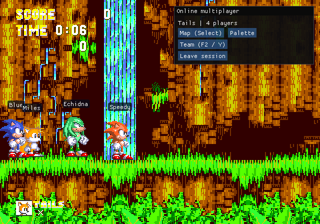

## Contents

- [Requirements](#requirements)
- [Install](#install)
- [Start a session](#start-a-session)
- [Playing over the internet](#playing-over-the-internet)
- [Features](#features)
- [Controls](#controls)
- [Update or uninstall](#update-or-uninstall)
- [Troubleshooting](#troubleshooting)
- [Known limitations](#known-limitations)
- [Building from source](#building-from-source)
- [License](#license)

## Requirements

- Windows 10 or 11, 64-bit.
- A working installation of the **official Sonic 3 & Knuckles Recomp v0.5.2** for Windows x64, set up with your own combined *Sonic 3 & Knuckles* World ROM.
- Every player needs the **same** Online Adventure version. Different previews cannot join each other.
- For internet play, the host needs TCP and UDP port **7777** reachable (port forwarding or a shared VPN). See [Playing over the internet](#playing-over-the-internet).

The mod checks the game executable before it enables anything. Only this build is supported:

```
Sonic3KRecomp.exe  SHA-256  390d3a3448a70afabd0e0b04e703a2a299fa961fc4182b8e73396b3377185dfd
```

To check yours, open PowerShell in the game folder and run:

```powershell
Get-FileHash .\Sonic3KRecomp.exe -Algorithm SHA256
```

Renaming another version does not make it compatible.

## Install

1. **Get the game working first.** Launch the official v0.5.2 `Sonic3KRecomp.exe` once and make sure it reaches the title screen with your ROM. Then close it completely.
2. **Download the mod.** Open this repository's [Releases](../../releases) page and download `Online Adventure shared-world preview.15.zip` from the latest release.
3. **Find your game folder.** This is the folder that contains `Sonic3KRecomp.exe`.
4. **Back up an existing loader (if any).** If that folder already has a `version.dll` from another mod loader, copy it somewhere safe first. Online Adventure installs its own `version.dll`.
5. **Copy the files.** Extract the zip and copy these three items into the game folder, keeping the folder structure exactly as it is:

   ```
   <game folder>\
   ├── Sonic3KRecomp.exe              (already there, unchanged)
   ├── version.dll                    (from the zip)
   ├── online-adventure.ini           (from the zip)
   └── mods\
       └── online-adventure\
           └── OnlineAdventure.dll    (from the zip)
   ```

   The other files in the zip (`README.md`, `VALIDATION.md`, `LICENSE.md`, `licenses\`, `SHA256.json`, `validation-results.json`) are documentation. You can keep them anywhere.
6. **Disable conflicting mods.** Turn off character-replacement mods such as *Knuckles & Knuckles* in the launcher's mod list.
7. **Launch the game normally** with your existing `Sonic3KRecomp.exe`. *Online Adventure* appears in the launcher's mod list. If you change its enabled toggle there, restart the game.

   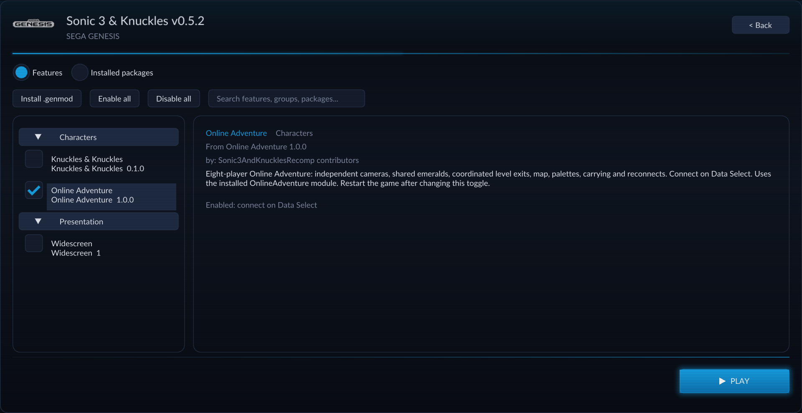

   This mod is installed by copying files, as above. It is not a `.genmod` package, so do not use the launcher's *Install .genmod* button for it.

Repeat these steps on every player's computer.

## Start a session

1. Every player starts the game and goes to **Data Select**.
2. Choose **Connect with players**, enter your name, and pick **Sonic, Tails or Knuckles**.
3. **One player hosts:** select **Host game**. The default port is **7777**.
4. **Everyone else joins:** enter the host's IP address and the same port, then select **Join game**.
5. When everyone is listed in the lobby, each player selects **Ready**.
6. The host selects **Start together**. A new *No Save* adventure begins in Angel Island for everyone.

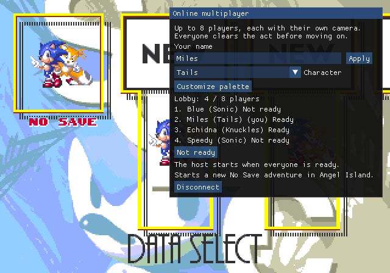

If Sonic is in the party, everyone watches the Angel Island opening first. Knuckles players follow the Sonic and Tails story route, so the whole party travels together.

## Playing over the internet

- **Same home network:** use the host computer's local IP address, such as `192.168.1.20`. You can find it by running `ipconfig` in a command prompt on the host and looking for *IPv4 Address*.
- **Over the internet:** the host's router must forward port **7777** for **both TCP and UDP** to the host computer. Players then join with the host's public IP address.
- **Without port forwarding:** a shared virtual LAN or VPN that puts all players on one network works too. Use the host's address on that network.
- When Windows Firewall asks whether to allow the game on the network, allow it, at least on private networks.

## Features

All screenshots are from Angel Island Zone with the current build.

### One shared world, a camera for each player
Badnik destruction, monitors, platforms, switches, rings, boss health and terrain changes are the same for everyone. A monitor's reward goes only to the player who broke it. Each player keeps their own camera, so the party can spread out across the act. Player names float above each character.


### Live character colors
Use **Palette** to recolor your character in the lobby or during play. Everyone sees the change right away, including in special stages. Mouths, gloves and grey details are protected so they stay readable.

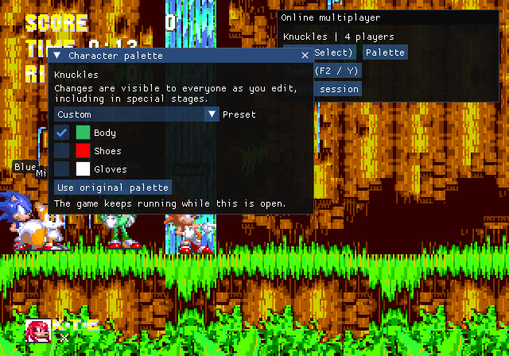

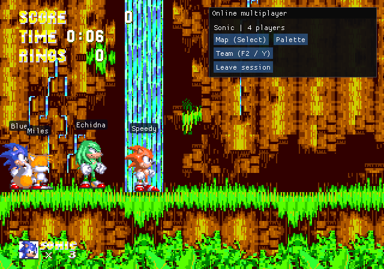

### Level map
Press **Select / Back** (or **Backspace**) to open a map built from the level's own art, showing every player's position. Zoom with Jump or the mouse wheel, and pan with the D-pad or a right-drag.

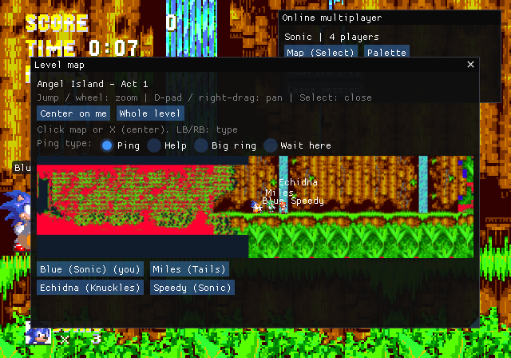

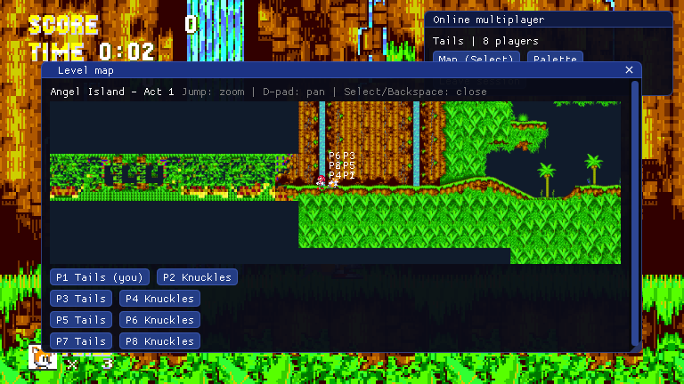

### Map pings
Click the map, or press **X** to ping the center of the view. **LB / RB** pick the ping type: *Ping*, *Help*, *Big ring* or *Wait here*. Everyone sees the marker.

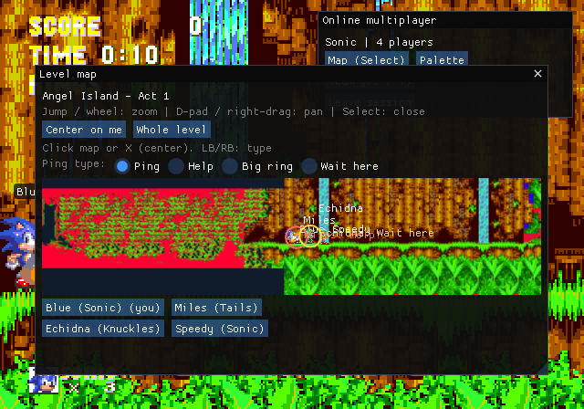

### Team menu, shared emeralds and rescue
Press **F2** (or **Y** on a controller) for the team menu. You can change your name, toggle name tags and see the party's shared Chaos and Super Emeralds. If you're stuck, it can teleport you to a teammate or back to your checkpoint, if the host allows rescue.

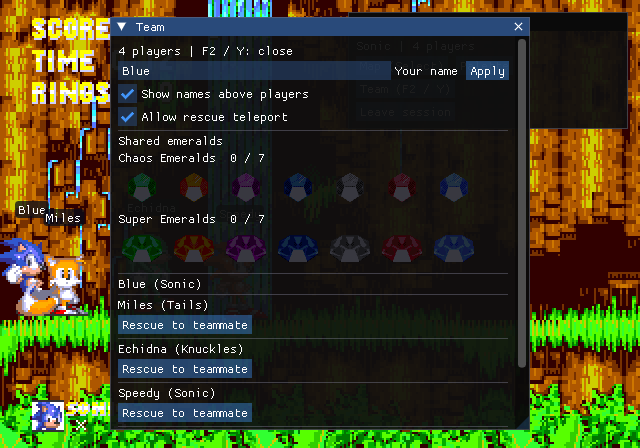

When a player wins an emerald, everyone gets a notice in the bottom right.

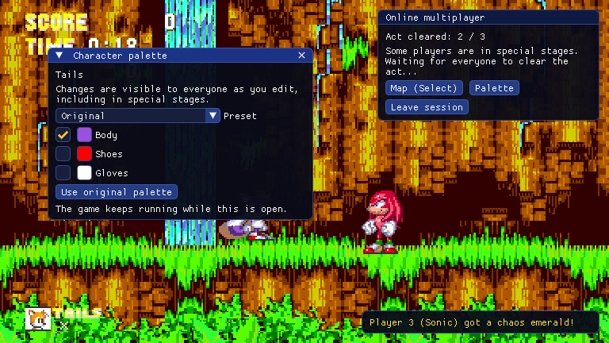

### Tails can carry teammates
Tails can fly Sonic or Knuckles around. Springs, badniks and terrain still affect the passenger. A hit or a spring releases the carry, and everyone sees it.

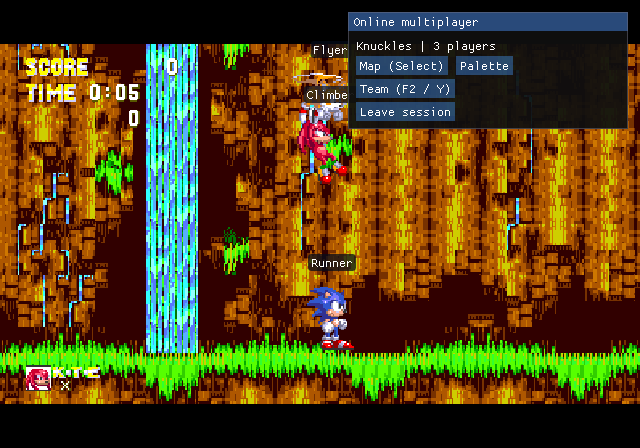

### Moving on together
Every player must finish an act before the party moves on. That includes level changes without a results screen. Players who finish first see how many are done.

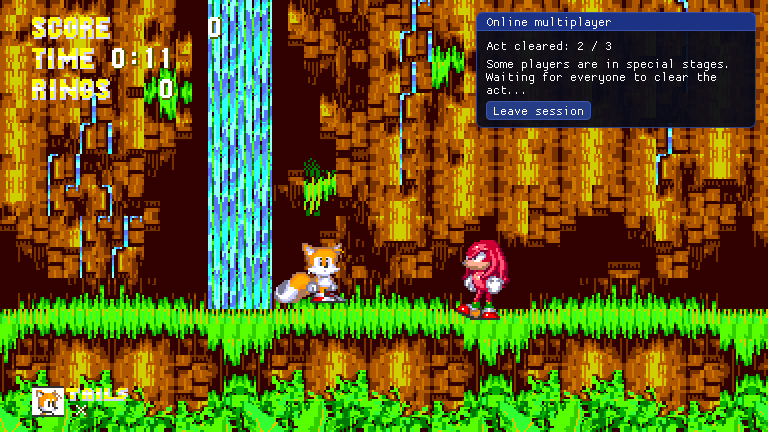

While waiting, you can watch a teammate's live view.

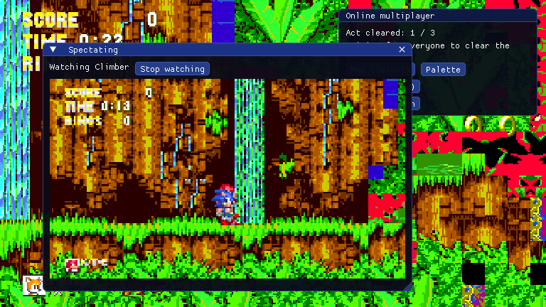

### Special stages
Entering a big ring takes only you into the special stage. The ring disappears for everyone, and the rest of the party keeps playing. Emeralds are shared, and the next big ring always picks the next stage nobody has cleared yet.

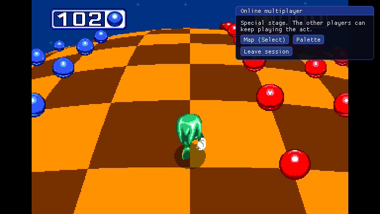

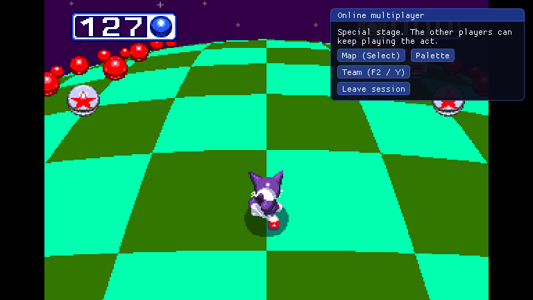

The map shows who is away in a special stage.

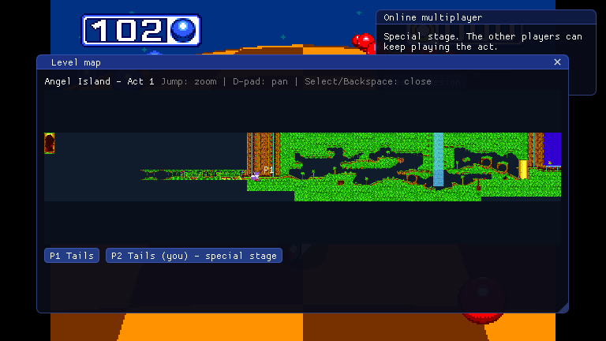

### Story scenes and bosses
Bosses share their health, and story scenes play on every player's screen. In Hidden Palace each player fights Knuckles on their own screen, his health is shared, and the party reaches Sky Sanctuary together. With all seven Chaos Emeralds and a Sonic player in the party, only Sonic players fly Doomsday. Tails and Knuckles players watch a Sonic player's live view, and then everyone enters the ending together. [docs/VALIDATION.md](docs/VALIDATION.md) lists what has been tested.

## Controls

| Action | Keyboard | Controller |
|---|---|---|
| Level map | Backspace | Select / Back |
| Zoom the map | Jump | Jump |
| Pan the map | Arrow keys | D-pad |
| Place a ping | Click the map | X (center of view) |
| Change ping type | | LB / RB |
| Team menu | F2 | Y |
| Release from a carry (passenger) | Jump | Jump |
| Drop your passenger (Tails) | Down + Jump | Down + Jump |

The **Online multiplayer** panel shows buttons for *Map*, *Palette*, *Team* and *Leave session*.

## Update or uninstall

- **Update:** close the game and replace `version.dll`, `online-adventure.ini` and `mods\online-adventure\OnlineAdventure.dll` with the files from the new release. Every player must update.
- **Uninstall:** close the game and delete `version.dll`, `online-adventure.ini` and the `mods\online-adventure` folder. If you backed up another loader's `version.dll`, put it back. Leave `Sonic3KRecomp.exe` and your own files in place.

## Troubleshooting

| Problem | What to try |
|---|---|
| *Online Adventure* is missing from the mod list | Check that `version.dll` sits next to `Sonic3KRecomp.exe` and `OnlineAdventure.dll` is in `mods\online-adventure\`. Check the executable's hash against the one under [Requirements](#requirements). |
| Can't join the host | Confirm the IP address and port. Over the internet, forward port 7777 for both TCP and UDP, or use a shared VPN. Allow the game through Windows Firewall. |
| Join is refused or the session drops right away | Everyone must run the same Online Adventure release. |
| Antivirus warns about `version.dll` | Mod loaders that use a `version.dll` proxy are sometimes flagged. Check the file against `SHA256.json` in the release zip. |
| Characters look wrong or swap | Disable other character mods such as *Knuckles & Knuckles*. |
| Stuck somewhere in a level | Open the team menu (F2 / Y) and use *Rescue to teammate* or *Rescue to my checkpoint*. The host can allow or disallow rescue. |

## Known limitations

- The campaign has not been played start to finish online. Encounters tested so far are listed in [docs/VALIDATION.md](docs/VALIDATION.md).
- In Hidden Palace, Knuckles runs his own moves on each player's screen. Only his health is shared.
- Long sessions with heavy object counts and real internet conditions with many players need more testing.
- Saving is not used: sessions start a new No Save adventure.

## Building from source

See [docs/BUILDING.md](docs/BUILDING.md). Builds that you share with others must use `OA_TEST_CONTROL=OFF`.

## License

Online Adventure is released under the [PolyForm Noncommercial License 1.0.0](LICENSE.md). Third-party licenses are in [licenses/](licenses/).

Sonic the Hedgehog, Sonic 3 & Knuckles and related characters are trademarks of SEGA. This is an unofficial fan project, not affiliated with or endorsed by SEGA. No game data is included. You need your own copy of the game.
